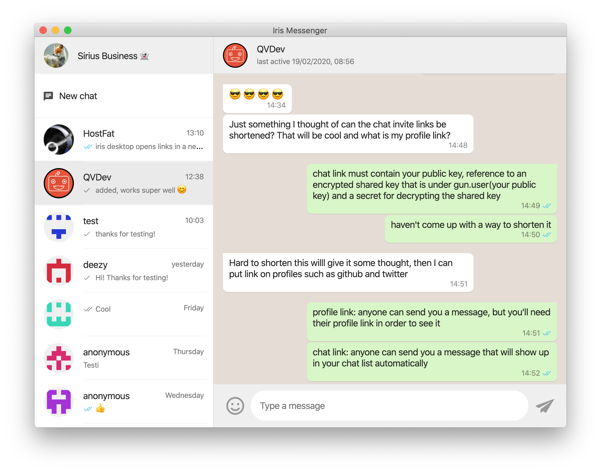

# Iris
Iris is like the social networking apps we're used to, but better.
* No phone number or signup required. Just type in your name or alias and go!
* Secure: It's open source. Users can validate that big brother doesn't read your private messages.
* Available: It works offline-first and is not dependent on any single centrally managed server. Users can even connect directly to each other.



## Use
Browser application: [iris.to](https://iris.to)

Desktop version: ([download](https://github.com/irislib/iris-electron/releases), [source code](https://github.com/irislib/iris-electron)):
* Communicate and synchronize with local network peers without Internet access
  * When local peers eventually connect to the Internet, your messages are relayed globally
  * Bluetooth support upcoming
* Opens to background on login: stay online and get message notifications!
* More secure and available: no need to open the browser application from a server.

## Develop
```
git clone git@github.com:irislib/iris-messenger.git
cd iris-messenger
yarn
yarn start
```

Eslint: `yarn eslint src/js/*.js`

The application was originally built in plain jQuery without a framework. While we now use [preact](https://preactjs.com/), there's still some jquery logic that should be ported.

## Privacy
Private messages are end-to-end encrypted, but message timestamps and the number of chats aren't. In a decentralized network this information is potentially available to anyone.

By looking at timestamps in chats, it is possible to guess who are chatting with each other. It is also possible, if not trivial, to find out who are communicating with each other by monitoring data subscriptions on the decentralized database.

In that regard, Iris prioritizes decentralization and availability over perfect privacy.

Profile names, photos and online status are currently public. That can be changed when advanced group permissions are developed.

The application is an unaudited proof-of-concept implementation, so don't use it for security critical purposes.

## Contact
Join our [Discord](https://discord.gg/4Dgf54k) or send me a message on [Iris](https://iris.to/?chatWith=hyECQHwSo7fgr2MVfPyakvayPeixxsaAWVtZ-vbaiSc.TXIp8MnCtrnW6n2MrYquWPcc-DTmZzMBmc2yaGv9gIU&s=HlzYzNrhUsrn2PLi4yuRt6DiFUNM3hOmN8nFpgw6T-g&k=zvDfsInsMOI1).
